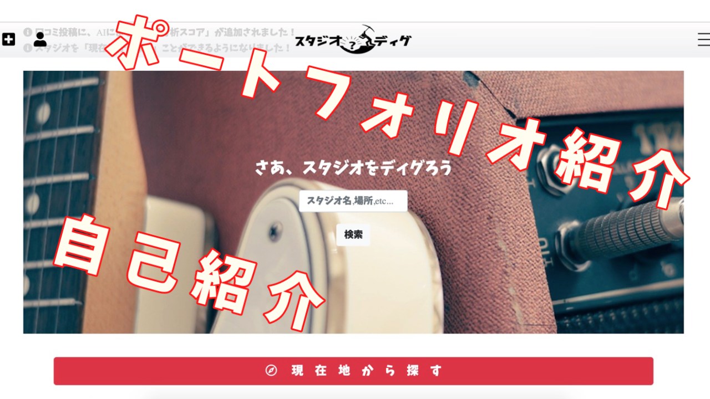

# スタジオディグ

## アプリケーション紹介動画
[こちらからご覧ください(YOUTUBEへ遷移します)](https://www.youtube.com/watch?v=E-DYfkHip_A)

## アプリケーション概要

「スタジオディグ」は、個人開発アプリケーションとして制作した自作WEBアプリケーションです。 
 
お気に入りの音楽スタジオを共有し、口コミレビューやいいねを送り合ってコミュニケーションを取ることができます。 
製作背景については、下記に記します。 
 
Google Maps APIを導入し、投稿した住所情報から店舗地図の表示。また、現在地からスタジオを探す機能の実装しユーザーにとって使いやすい使用感を目指しました。Rspecによるテスト(model,request,system)は、116項目のexampleをパスしました。 
 
また、UI/UXにも配慮し、使っていて楽しくなるようなWEBアプリを目指して作成しました。 
 
インフラにつきましては、AWS(EC2, RDS, Route53, ACM, ALB, IAM等)や実行環境をDockerfileにより共有でき、環境構築を容易にするDockerなどのモダンな技術に挑戦しました。 
 

### URL

[https://studio--dig.com/](https://studio--dig.com/) 
 
* 常時SSL化
* ログインページにかんたんログインボタン（採用担当者様はこちらへ）を配置しております。

### テーマを選んだ理由

私は、学生時代からバンド活動をしており、その活動の中で音楽スタジオを頻繁に利用していました。 
名のあるスタジオを利用することもありますが、私は小規模経営されているようなスタジオを「発掘」することが 趣味の一つでもありました。 
当時は、良いスタジオを発掘したらメンバーに共有したり、逆に良いスタジオがあれば教えてもらったりしていました。 
ただ、世の中には私の知らない「穴場スタジオ」が、まだまだ数多く存在しています。 
もっと多くの情報が得たいと思い、スタジオディグの着想を得ました。 
以上のような背景から、スタジオ版口コミサイトがあれば、より多くの情報を得ることができ、 
さらには、世のバンドマンや個人で楽器を演奏する方たちにとっても、役立つのではないかと思いこちらのテーマを選びました。 

## 設計書

## 機能一覧
* ユーザー登録・ログイン機能（gem:deviseを使用）
* 投稿機能（画像のアップロードにgem:refileを使用）
* 投稿画像のリサイズ
* 画像アップロード時のプレビュー機能（ajaxを用いた非同期通信）
* 投稿一覧、投稿詳細表示機能
* 投稿管理機能
* 投稿編集機能
* ページネーション機能(gem:kanimari)
* スタジオお気に入り機能
* 口コミ投稿機能
* 星評価機能（jQueryライブラリ使用）
* 口コミいいね機能
* フォロー、フォロワー機能
* Google Map表示機能（Google MAps API）
* 現在地検索機能（Google MAps API）
* キーワード検索機能
* Rspec/Rubocop　テスト機能
* お気に入り登録が多いスタジオをランキング形式で表示する機能
* タグ機能
* 環境変数化（gem:dotenv）
* Bootstrap4によるレスポンシブ対応
* トップページ内、新着レビュー・新着スタジオ表示にswiper導入（jQuery使用）

## 使用技術

- HTML
- CSS
- Javascript / JQuery / Ajax
- Ruby 2.5.3 / Slim 記法
- Ruby on Rails 5.2.4 (RSpec / Rubocop による動的静的テスト等も含む)
- MySQL
- Linux (各種コマンド操作)
- Nginx (Web Server)
- Puma (Application Server)
- Git / GitHub (pull request, Issues 等による擬似チーム開発)
- Docker / docker-compose
- AWS 各種サービス
- CircleCI/CD
- Capistrano
- AWS
    EC2 ( Amazon Linux 2 ) / RDS(MySQL) / S3 / VPC / IAM / Route53 / ACM / ALB

## 開発環境

- OS：Linux(CentOS)
- 言語：HTML,CSS,JavaScript,Ruby,SQL
- フレームワーク：Ruby on Rails
- JS ライブラリ：jQuery
- IDE：Cloud9

## 使用素材

- Font Awesome https://fontawesome.com/
- Font Free https://fontfree.me/
- Ivons8 https://icons8.jp/
- photoAC https://www.photo-ac.com/
